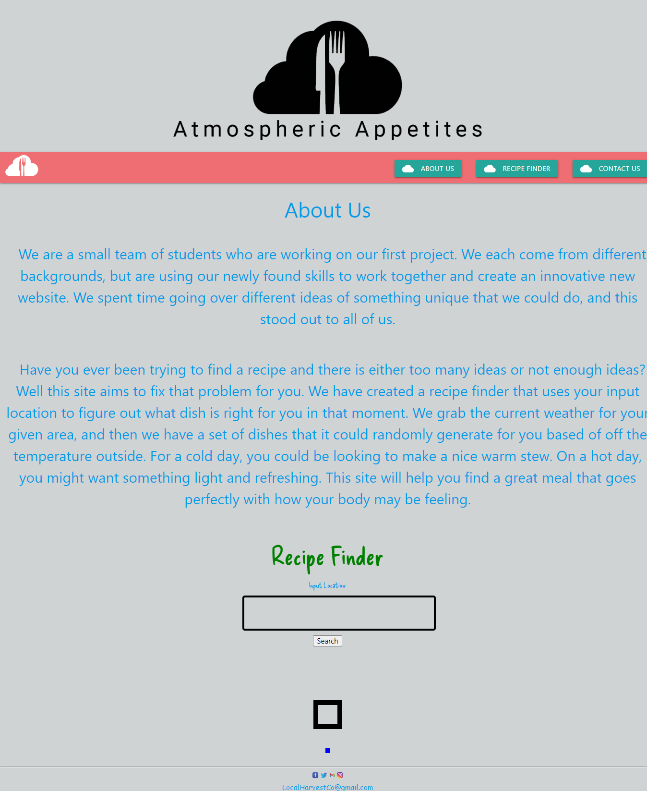

# Atmospheric Appetites
```
    Interactive Front-End Project
```

## Description
This app was a collaborative effort between developers in which we used two APIs to gather weather data and food based on that weather data. We wanted to create an app that used javascript to create the html elements that would hold the data from the API call. To style our application we used the Materialize framework due to its easy of use. Our goal was to create an app that would give users a meal suggestion based on temperature in a city.


## Technologies Used
1. [OpenWeather](https://openweathermap.org/)
2. [MealsDB](https://www.themealdb.com/api.php)
3. [Materialize](https://materializecss.com/)
4. [jQuery](https://jquery.com/)


## Screenshot



## Link
[Click here](https://johnfoxwell.github.io/atmospheric-appetites/)


## Developed By:
```
John Foxwell
Derique Fowlkes
Brandon Hutchinson
Matthew Tiller
```
